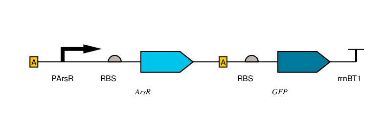
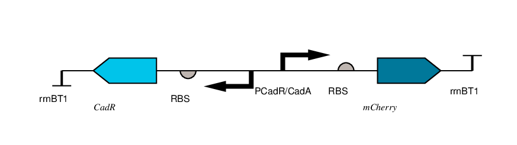
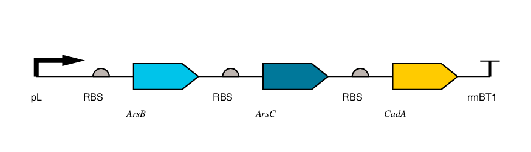
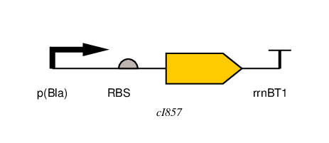
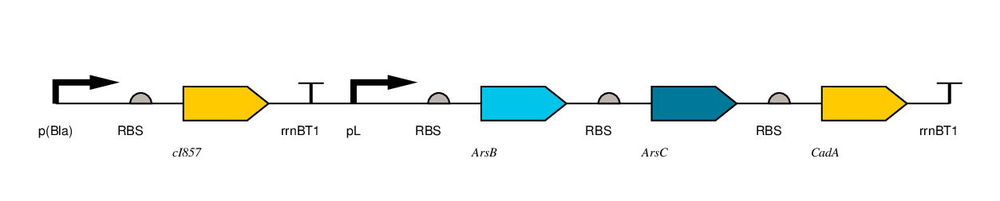

# Synthetic-Biobots-IGEM-DL-2021
Information about Synthetic Biobots team participating during IGEM Design League 2021.

In this repository you can find parts that were used by Synthetic Biobots with the purpose of developing the IGEM Design League project for 2021. In the descriptions section of this ReadMe file you will find a description of each file in this repository and aditional information.
For more information you can also see the main paga of the project on the [JOGL platform](https://app.jogl.io/project/795/Nueveaguas).

## Descriptions

### Previous iGEM registered Parts

* [BBa_B0010](BBa_B0010.fasta): rrnBT1 (Terminator) from [iGEM Part:BBa_B0010](http://parts.igem.org/Part:BBa_B0010). Designed by: Randy Rettberg Group: Antiquity (2003-11-19).

* [BBa_I14018](BBa_I14018.fasta): p(Bla) (Constitutive promoter), E. coli sigma70, from [iGEM Part:BBa_I14018](http://parts.igem.org/Part:BBa_I14018). Designed by: Vikram Vijayan, Allen Hsu, Lawrence Fomundam Group: Antiquity (2004-08-02).

* [BBa_J61100](BBa_J61100.fasta): RBS (Ribosome Binding Site) from [iGEM Part:BBa_J61100](http://parts.igem.org/Part:BBa_J61100). Designed by: John Anderson Group: Arkin Lab (2007-01-28).

* [BBa_K200016](BBa_K200016.fasta): Temperature Sensitive Lambda cI Repressor, with cI857 mutation, from [iGEM Part:BBa_K200016](http://parts.igem.org/Part:BBa_K200016). Designed by: Royah Vaezi Group: iGEM09_Imperial College London (2009-10-14). 

* [BBa_K2282004](BBa_K2282004.fasta): pL (Promoter), from [iGEM Part:BBa_K2282004](http://parts.igem.org/Part:BBa_K2282004). Designed by: Eliott LAFON Group: iGEM17_IONIS-PARIS (2017-10-02). The promoter is repressed at low temperature by cI857 protein, this protein loses repression activity when temperature rises from 30°C until 42°C.

### Synthetic Biobots Parts

* [IDLBB_002051](IDLBB_002051.fasta): Arsenic Biosensor Transcriptional Unit. Made of ABS ([IDLBB_002056](IDLBB_002056.fasta)) 23-56, PArsR ([IDLBB_002057](IDLBB_002057.fasta)) 49-85, RBS ([BBa_J61100](BBa_J61100.fasta)) 94-107, ArsR ([IDLBB_002058](IDLBB_002058.fasta)) 114-467, ABS ([IDLBB_002056](IDLBB_002056.fasta)) 476-509, RBS ([BBa_J61100](BBa_J61100.fasta)) 518-531, GFP ([IDLBB_002059](IDLBB_002059.fasta)) 538-1257 and rrnBT1 ([BBa_B0010](BBa_B0010.fasta)) 1266-1345.

* [IDLBB_002052](IDLBB_002052.fasta): Cadmium Biosensor Transcriptional Unit. Made of Complement rrnBT1 ([BBa_B0010](BBa_B0010.fasta)) 23-102, Complement CadR ([IDLBB_002060](IDLBB_002060.fasta)) 111-554, Complement RBS ([BBa_J61100](BBa_J61100.fasta)) 561-574, Complement PCadR/CadA ([IDLBB_002061](IDLBB_002061.fasta)) 583-666, RBS ([BBa_J61100](BBa_J61100.fasta)) 675-688, mCherry ([IDLBB_002062](IDLBB_002062.fasta)) 695-140 and rrnBT1 ([BBa_B0010](BBa_B0010.fasta)) 1414-1493.

* [IDLBB_002053](IDLBB_002053.fasta): Cadmium and Arsenic Remediaton Transcriptional Unit. Made of pL ([BBa_K2282004](BBa_K2282004.fasta)) 23-266, RBS ([BBa_J61100](BBa_J61100.fasta)) 275-288, ArsB ([IDLBB_002063](IDLBB_002063.fasta)) 295-1584, RBS ([BBa_J61100](BBa_J61100.fasta)) 1593-1606, ArsC ([IDLBB_002064](IDLBB_002064.fasta)) 1613-2038, RBS ([BBa_J61100](BBa_J61100.fasta)) 2047-2060, CadA ([IDLBB_002065](IDLBB_002065.fasta)) 2067-4280 and rrnBT1 ([BBa_B0010](BBa_B0010.fasta)) 4289-4368.

* [IDLBB_002054](IDLBB_002054.fasta): Temperature Sensitive Lambda cI Repressor Transcriptional Unit. Made of p(Bla) ([BBa_I14018](BBa_I14018.fasta)) 23-57, RBS ([BBa_J61100](BBa_J61100.fasta)) 66-79, cI875 ([BBa_K200016](BBa_K200016.fasta)) 86,799 and rrnBT1 ([BBa_B0010](BBa_B0010.fasta)) 808-887.

* [IDLBB_002055](IDLBB_002055.fasta): BioBrick composed by [IDLBB_002054](IDLBB_002054.fasta) and [IDLBB_002053](IDLBB_002053.fasta)

* [IDLBB_002056](IDLBB_002056.fasta): ABS (ArsR Binding Site), as in [Xu, C. (1996)](https://doi.org/10.1074/jbc.271.5.2427).

* [IDLBB_002057](IDLBB_002057.fasta): PArsR (ArsR Promoter), as in [Xu, C. (1996)](https://doi.org/10.1074/jbc.271.5.2427).

* [IDLBB_002058](IDLBB_002058.fasta): ArsR (CDS), Metalloregulatory Protein from Escherichia coli str. K-12 substr. MG1655, complete genome [U00096.3](https://www.ncbi.nlm.nih.gov/nuccore/U00096.3/) (3648528..3648881). In absence of arsenate represses transcription by binding [ABS](IDLBB_002056.fasta), in its presence it allows transcription.

* [IDLBB_002059](IDLBB_002059.fasta): GFP (CDS) Green Fluorescent Protein.

* [IDLBB_002060](IDLBB_002060.fasta): CadR (CDS), Regulatory protein from Pseudomonas putida, complete genome [CP007620.1](https://www.ncbi.nlm.nih.gov/nuccore/CP007620.1/) (5933128..5933571). In absence of cadmium it binds [PCadR/CadA](IDLBB_002061.fasta) and represses CadA transcription, in its presence it allows and favors transcription.

* [IDLBB_002061](IDLBB_002061.fasta): PCadR/CadA (Bidirectional promoter), from Pseudomonas putida, complete genome [CP007620.1](https://www.ncbi.nlm.nih.gov/nuccore/CP007620.1/) (5933044..5933127).

* [IDLBB_002062](IDLBB_002062.fasta): mCherry (CDS), Fluorescent protein, with a synonymal puntual mutation (357), G to A, in order to achieve standarization [RFC[10]](http://parts.igem.org/Help:Standards/Assembly/RFC10).

* [IDLBB_002063](IDLBB_002063.fasta): ArsB (CDS), arsenite/antimonite:H(+) antiporter from Escherichia coli str. K-12 substr. MG1655, complete genome [U00096.3](https://www.ncbi.nlm.nih.gov/nuccore/U00096.3/) (3648935..3650224).

* [IDLBB_002064](IDLBB_002064.fasta): ArsC (CDS), Arsenate Reductase from Escherichia coli str. K-12 substr. MG1655, complete genome [U00096.3](https://www.ncbi.nlm.nih.gov/nuccore/U00096.3/) (3650237..3650662)

* [IDLBB_002065](IDLBB_002065.fasta): CadA (CDS), Cadmium transporting ATPase from Pseudomonas putida, Regulatory protein from Pseudomonas putida, complete genome [CP007620.1](https://www.ncbi.nlm.nih.gov/nuccore/CP007620.1/) Complement(5930830..5933043), synonymal puntual mutation (213), A to G, in order to achieve standarization [RFC[10]](http://parts.igem.org/Help:Standards/Assembly/RFC10).
